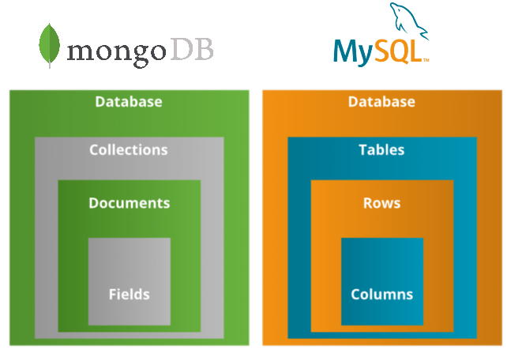
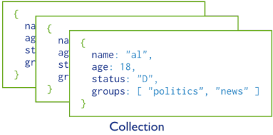
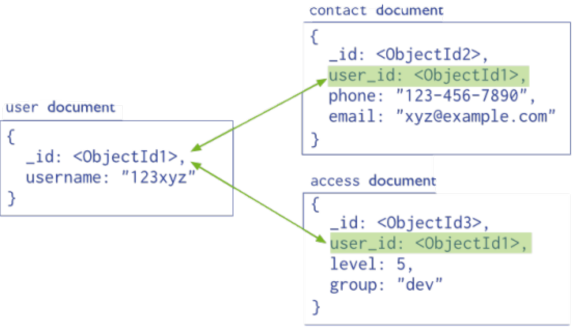

<!--
_header: ''
_footer: <br>Esta obra está bajo una [licencia de Creative Commons Reconocimiento-NoComercial-CompartirIgual 4.0 Internacional](http://creativecommons.org/licenses/by-nc-sa/4.0/). Icono diseñado por Flaticon
-->
<style>
img[alt~="center"] {
  display: block;
  margin: 0 auto;
}
img {
  background-color: transparent!important;
}
li {
  text-align: justify;
}
</style>


# TEMA 3.1

**Mongodb** - bases de datos documentales

---
<style scoped>
{ font-size: 1.4rem; }
</style>
## Introducción

# Introducción a Mongodb

---

# Sistemas de almacenamiento

- Datos **estructurados**
  - Hojas de calculo
  - Bases de datos relacionales
- Datos **semi-estructurados** o **no estructurados**
  - Se necesita un rediseño del sistema de almacenamiento

---
# Características de Mongodb

- MongoDB ("humongous") es una **base de datos orientada a documentos**
- Lídes de las bases de datos **NoSQL**
- Es **gratis** y **open-source**
- Usa **UTF-8** como codificación
- http://www.mongodb.org/
---
<style scoped>
p { font-size: 0.7rem; }
li { font-size: 0.7rem}
</style>

# JSON: JavaScript Object Notation

- La información en MongoDB utiliza un formato basado en **JSON** para su sintaxis:
```
 {
   "clientes":
   [
      {
        "apellido":"Alonso", 
        "gasto": 100, 
        "es_habitual": true,
        "productos": [
                        "P001", 
                        "P032", 
                        "P099"
                      ]
      },
    ...
   ]
 }
```
---

# Mongodb vs SQL

 

---

# Documentos

- MongoDB almacena la información en forma de **documentos**
  - ... que son pares clave-valor en formato **JSON**
  
 


---

# Colecciones

- MongoDB almacena todos los documentos en **colecciones**

  - Una colección es un **grupo de documentos relacionados** semánticamente

 

---

# Queries

- En MongoDB las consultas se hacen sobre una colección de documentos

  - Se especifican los criterios de los documentos a recuperar


 


--- 

# Conceptos básicos

- Los documentos en MongoDB tienen un **esquema flexible**
  - Las colecciones de MongoDB **no obligan a que sus documentos tengan un formato único**

- Una colección puede tener varios documentos con una estructura diferente
  - En la práctica los documentos de una colección comparten una estructura similar
  - Todos los documentos tendrán un campo _id


---

# Relaciones entre documentos

- ¿Cómo se representan las **relaciones** entre los datos?
- Existen **dos** formas de hacerlo:
  - **Referencias** a otros documentos
  - **Subdocumentos**
> Se permite (y aconseja) duplicar información


---

# Modelo normalizado

Ejemplo de modelo normalizado para Mongodb

 

---

# Modelo con subdocumentos

Ejemplo de modelo embedido para Mongodb

 
